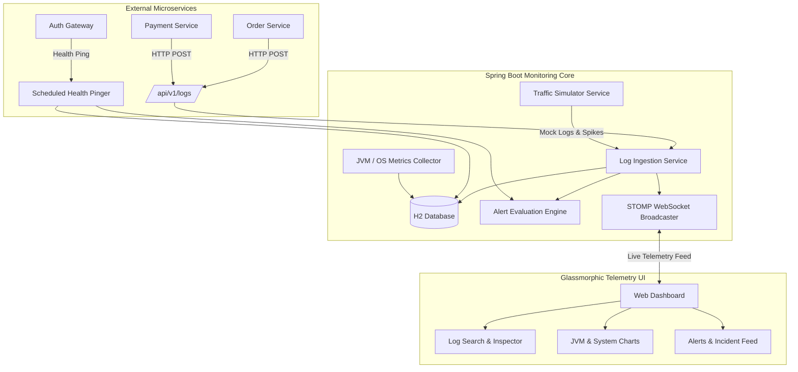

# ⚡ PULSE — Centralized Logging & System Health Monitoring Tool


**PULSE** is a full-stack, enterprise-ready **Centralized Logging & System Health Monitoring Platform** built with **Java / Spring Boot 3** and an interactive, dark-mode **Glassmorphism Web Telemetry Dashboard**.

It provides real-time log ingestion, structured multi-filtering log search, STOMP WebSockets streaming, JVM & hardware telemetry (CPU, Heap memory, GC, active threads, disk space), automated alert evaluation, and a built-in multi-service cluster simulator out-of-the-box.

---

## 🌟 Key Features

- 📥 **Centralized Log Ingestion**: High-performance REST APIs (`POST /api/v1/logs` and batch `/api/v1/logs/batch`) supporting microservice tags, trace IDs, span IDs, and exception stack traces.
- ⚡ **Real-Time Live Log Stream**: STOMP over SockJS WebSockets (`/ws-monitoring`) broadcasting logs live to the dashboard with auto-scroll and stream pause controls.
- 🔍 **Advanced Log Explorer**: Paginated multi-filter search by service name, log level (`INFO`, `WARN`, `ERROR`, `DEBUG`), trace ID, time window, and free-text keyword search.
- 📊 **JVM & System Telemetry**: Dynamic Chart.js visualizations for OS/Process CPU load, JVM Heap usage, GC pause cycles, and a doughnut chart breakdown of thread states (`RUNNABLE`, `WAITING`, `TIMED_WAITING`, `BLOCKED`).
- 🩺 **Service Health Node Pinger**: Background pinger monitoring external microservice nodes (`auth-service`, `payment-gateway`, `order-service`, `inventory-api`) measuring response latency and status (`UP`, `DOWN`, `DEGRADED`).
- 🚨 **Automated Alerting & Incident Management**: Rule evaluation engine (`ERROR_LOG_COUNT`, `SERVICE_DOWN`) that automatically triggers critical incident alerts and broadcasts them live.
- 🤖 **Embedded Cluster Simulator**: Built-in mock generator generating realistic multi-service logs, database connection timeouts, 500 errors, and synthetic fault injection for instant testing.

---

## 📐 Architecture Overview



---

## 🛠️ Tech Stack

- **Backend**: Java 25 / 17, Spring Boot 3.2.3, Spring Data JPA, Spring Web, Spring WebSocket (STOMP/SockJS), Spring Boot Actuator, Micrometer, H2 Database.
- **Frontend**: HTML5, Vanilla CSS3 (Custom Glassmorphic Dark Theme), Modern ES6 JavaScript, Chart.js, FontAwesome Icons, SockJS & STOMP.js.
- **Build Tool**: Apache Maven.

---

## 🔌 API Endpoints Reference

### 1. Log Ingestion & Search APIs
| Method | Endpoint | Description |
| :--- | :--- | :--- |
| `POST` | `/api/v1/logs` | Ingest a single log entry |
| `POST` | `/api/v1/logs/batch` | Ingest a batch list of logs |
| `GET` | `/api/v1/logs/recent` | Fetch top 50 recent logs |
| `GET` | `/api/v1/logs/search` | Paginated search with filters (`serviceName`, `logLevel`, `traceId`, `keyword`) |
| `GET` | `/api/v1/logs/stats` | Aggregate stats (logs by service, level, total errors) |

### 2. System & Health Metrics APIs
| Method | Endpoint | Description |
| :--- | :--- | :--- |
| `GET` | `/api/v1/health/metrics` | Retrieve live CPU, JVM Heap memory, GC stats, and thread breakdown |
| `GET` | `/api/v1/health/services` | List all registered monitored service nodes |
| `POST` | `/api/v1/health/services` | Register a new monitored service node |
| `POST` | `/api/v1/health/services/{id}/ping` | Trigger an immediate manual health ping |

### 3. Alerts & Incidents APIs
| Method | Endpoint | Description |
| :--- | :--- | :--- |
| `GET` | `/api/v1/alerts/rules` | Fetch all configured alert rules |
| `POST` | `/api/v1/alerts/rules` | Create a new alert threshold rule |
| `GET` | `/api/v1/alerts/incidents` | Fetch recent alert incidents feed |
| `POST` | `/api/v1/alerts/incidents/{id}/resolve` | Mark an incident as RESOLVED |

---

## 🚀 Getting Started

### Prerequisites
- Java 17 or higher installed (`java -version`)
- Maven 3.8+ (or Maven wrapper)

### Build & Run
1. Clone the repository:
   ```bash
   git clone https://github.com/YOUR_USERNAME/centralized-logging-monitoring.git
   cd centralized-logging-monitoring
   ```

2. Build the application:
   ```bash
   mvn clean package -DskipTests
   ```

3. Run the executable JAR:
   ```bash
   java -jar target/centralized-logging-monitoring-1.0.0.jar
   ```

4. Open your browser and navigate to:
   👉 **`http://localhost:8080`**

---

## 📸 Sample Log Ingestion Request

```json
POST /api/v1/logs
Content-Type: application/json

{
  "serviceName": "payment-gateway",
  "logLevel": "ERROR",
  "message": "PaymentProcessingException: Stripe API timeout after 5000ms",
  "traceId": "trace-a1b2c3d4",
  "environment": "PRODUCTION",
  "tags": "{\"cluster\": \"us-east-1\", \"userId\": \"98421\"}"
}
```

---

## 📄 License

This project is open-source under the [MIT License](LICENSE).
